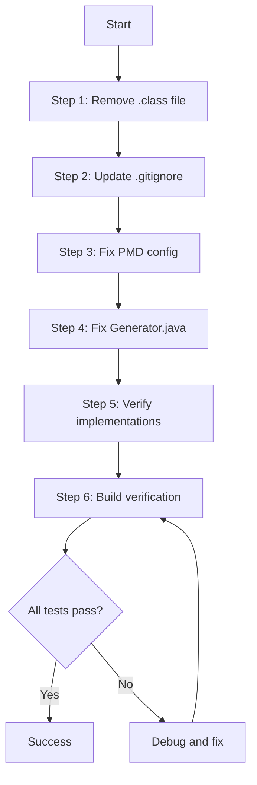

# MongOCOM Build Issues - Implementation Plan

## Overview

This document provides a step-by-step implementation plan to fix the identified build/compilation issues in the MongOCOM project after the Java 17 to Java 21 upgrade.

## Issues Summary

| # | Issue | Severity | Files Affected | Estimated Time |
|---|-------|----------|----------------|----------------|
| 1 | Compiled .class file in source directory | Medium | `MongoQuery.class` | 2 min |
| 2 | PMD targetJdk mismatch (17 vs 21) | High | `pom.xml` | 2 min |
| 3 | Missing .class exclusion in .gitignore | Low | `.gitignore` | 2 min |
| 4 | Raw type in Generator interface | Medium | `Generator.java` | 5 min |
| 5 | Build verification needed | High | All | 10 min |

**Total Estimated Time:** ~21 minutes

---

## Implementation Steps

### Step 1: Clean Source Directory
**Priority:** HIGH | **Time:** 2 minutes

**Action:**
```bash
# Remove the compiled .class file from source directory
rm src/main/java/com/arquivolivre/mongocom/management/MongoQuery.class
```

**Verification:**
```bash
# Ensure no .class files remain in source
find src -name "*.class"
# Should return no results
```

**Files Modified:** None (file deletion only)

---

### Step 2: Update .gitignore
**Priority:** MEDIUM | **Time:** 2 minutes

**Current .gitignore:**
```gitignore
/target/

# Example database configuration (contains sensitive data)
examples/conf/database.properties

# IDE files
.idea/
*.iml
.vscode/
.classpath
.project
.settings/

# OS files
.DS_Store
Thumbs.db
```

**Add to .gitignore:**
```gitignore
# Compiled class files (should never be in source)
*.class
```

**Files Modified:** `.gitignore`

---

### Step 3: Fix PMD Configuration
**Priority:** HIGH | **Time:** 2 minutes

**File:** `pom.xml`
**Line:** 100

**Current Configuration:**
```xml
<plugin>
    <groupId>org.apache.maven.plugins</groupId>
    <artifactId>maven-pmd-plugin</artifactId>
    <version>3.27.0</version>
    <configuration>
        <targetJdk>17</targetJdk>  <!-- WRONG -->
        <rulesets>
            ...
        </rulesets>
    </configuration>
</plugin>
```

**Updated Configuration:**
```xml
<plugin>
    <groupId>org.apache.maven.plugins</groupId>
    <artifactId>maven-pmd-plugin</artifactId>
    <version>3.27.0</version>
    <configuration>
        <targetJdk>21</targetJdk>  <!-- FIXED -->
        <rulesets>
            ...
        </rulesets>
    </configuration>
</plugin>
```

**Change:** Line 100: `<targetJdk>17</targetJdk>` → `<targetJdk>21</targetJdk>`

**Files Modified:** `pom.xml`

---

### Step 4: Fix Generator Interface Generic Type
**Priority:** MEDIUM | **Time:** 5 minutes

**File:** `src/main/java/com/arquivolivre/mongocom/utils/Generator.java`
**Line:** 23

**Current Code:**
```java
public interface Generator {
  <A extends Object> A generateValue(Class parent, MongoDatabase db);
}
```

**Issues:**
1. Raw type usage: `Class parent` (should be `Class<A> parent`)
2. Redundant bound: `<A extends Object>` (can be simplified to `<A>`)

**Fixed Code:**
```java
public interface Generator {
  <A> A generateValue(Class<A> parent, MongoDatabase db);
}
```

**Impact Analysis:**
- This interface is implemented by:
  - `DateGenerator.java`
  - `IntegerGenerator.java`
- Both implementations need to be checked for compatibility

**Files Modified:** `Generator.java`

---

### Step 5: Verify Implementation Classes
**Priority:** MEDIUM | **Time:** 3 minutes

**Files to Check:**
1. `src/main/java/com/arquivolivre/mongocom/utils/DateGenerator.java`
2. `src/main/java/com/arquivolivre/mongocom/utils/IntegerGenerator.java`

**Action:** Read these files to ensure they implement the interface correctly

---

### Step 6: Build Verification
**Priority:** HIGH | **Time:** 10 minutes

**Commands to Run (in order):**

1. **Clean Build:**
   ```bash
   mvn clean
   ```
   Expected: Success, target/ directory removed

2. **Compile:**
   ```bash
   mvn compile
   ```
   Expected: BUILD SUCCESS, no compilation errors

3. **Run Tests:**
   ```bash
   mvn test
   ```
   Expected: All tests pass

4. **Full Verification:**
   ```bash
   mvn verify
   ```
   Expected: BUILD SUCCESS

5. **Quality Checks:**
   ```bash
   ./check-quality.sh
   ```
   Expected: All checks pass (or only warnings)

6. **Static Analysis:**
   ```bash
   mvn spotbugs:check pmd:check checkstyle:check
   ```
   Expected: No critical issues

---

## Execution Order



---

## Success Criteria

- [ ] No .class files in source directory
- [ ] .gitignore properly excludes .class files
- [ ] PMD configured for Java 21
- [ ] Generator interface uses proper generics
- [ ] `mvn clean compile` succeeds
- [ ] `mvn test` - all tests pass
- [ ] `mvn verify` succeeds
- [ ] `./check-quality.sh` passes
- [ ] No new SpotBugs/PMD/Checkstyle errors

---

## Rollback Plan

If issues occur during implementation:

1. **Git Status Check:**
   ```bash
   git status
   git diff
   ```

2. **Revert Changes:**
   ```bash
   git checkout -- <file>
   ```

3. **Clean Build Directory:**
   ```bash
   mvn clean
   ```

---

## Post-Implementation

After successful implementation:

1. **Commit Changes:**
   ```bash
   git add .gitignore pom.xml src/main/java/com/arquivolivre/mongocom/utils/Generator.java
   git commit -m "fix: resolve build issues - PMD config, .class cleanup, generic types"
   ```

2. **Update Documentation:**
   - Mark issues as resolved in BUILD_ISSUES_ANALYSIS.md
   - Update README.md if needed

3. **Run CI/CD:**
   - Push changes to trigger CI pipeline
   - Verify all GitHub Actions pass

---

## Notes

- All changes are non-breaking
- No API changes required
- Backward compatible within Java 21
- No database migration needed
- No configuration changes for end users

---

## Contact

For questions or issues during implementation:
- Review: BUILD_ISSUES_ANALYSIS.md
- Check: java-upgrade-diagram.mmd
- Contact: Thiago da Silva Gonzaga <thiagosg@sjrp.unesp.br>
